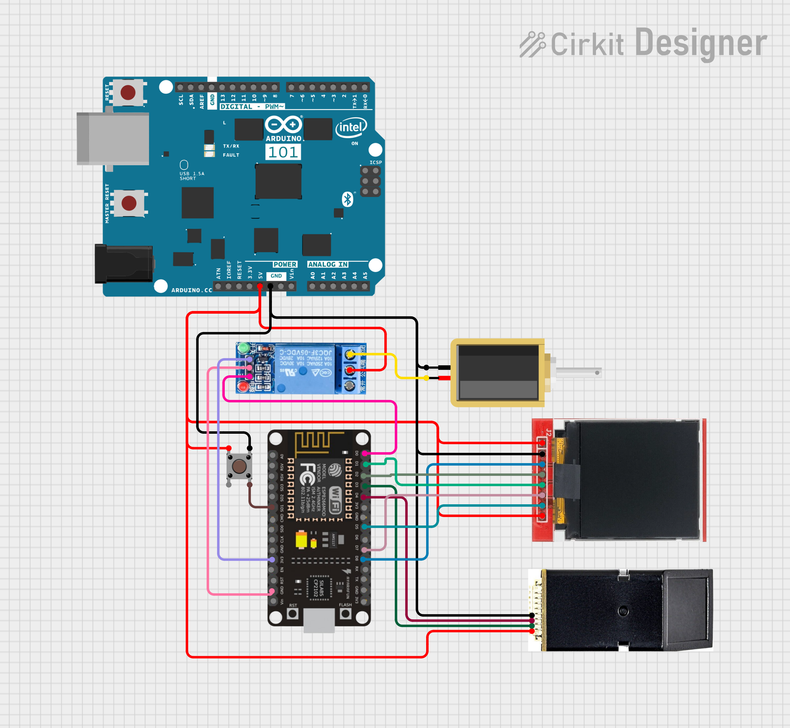

# BioSafe - Sistema de Segurança Biométrico

O BioSafe é um sistema de segurança baseado em biometria para controle de acesso, implementado com ESP8266 (NodeMCU) utilizando PlatformIO como ambiente de desenvolvimento.

## Sobre o PlatformIO

PlatformIO é um ambiente de desenvolvimento multiplataforma para sistemas embarcados que simplifica o desenvolvimento de projetos IoT. Diferente da Arduino IDE tradicional, o PlatformIO oferece:

- Gerenciamento automático de dependências
- Estrutura de projeto organizada
- Suporte para múltiplas plataformas
- Integração com diversos editores e IDEs (incluindo VS Code)
- Sistema de compilação avançado

O PlatformIO organiza projetos em uma estrutura padronizada de diretórios, facilitando a manutenção e reutilização de código.

## Estrutura do Projeto

```
biosafe-esp/
│
├── circuit_image.png          # Esquema de conexões do circuito
├── platformio.ini             # Configuração do projeto PlatformIO
│
├── include/                   # Headers globais e código compartilhado
│
├── lib/                       # Bibliotecas de terceiros
│   └── Adafruit-Fingerprint-Sensor-Library/  # Biblioteca para o sensor biométrico
│
└── src/                       # Código fonte principal
    ├── main.cpp               # Ponto de entrada do programa
    │
    ├── display/               # Módulo de gerenciamento do display
    │   ├── DisplayManager.cpp
    │   └── DisplayManager.h
    │
    ├── fingerprint/           # Módulo de gerenciamento do sensor biométrico
    │   ├── FingerprintManager.cpp
    │   └── FingerprintManager.h
    │
    ├── lock/                  # Módulo de controle da fechadura
    │   ├── LockManager.cpp
    │   └── LockManager.h
    │
    ├── mqtt/                  # Módulo de comunicação MQTT
    │   ├── MqttManager.cpp
    │   └── MqttManager.h
    │
    └── wifi/                  # Módulo de conexão WiFi
        ├── WifiManager.cpp
        └── WifiManager.h
```

## Diagrama do Circuito

O diagrama abaixo mostra as conexões entre o NodeMCU, o sensor de impressão digital, o display TFT e a fechadura eletrônica:



## Módulos do Sistema

O projeto é organizado em cinco módulos principais, cada um com uma responsabilidade específica:

### 1. DisplayManager
Gerencia o display TFT (pinos CS:15, DC:5, RST:4) para interação com o usuário.

### 2. FingerprintManager
Controla o sensor biométrico (pinos RX:0/D3, TX:2/D4) permitindo autenticação e registro de digitais.

### 3. LockManager
Administra a fechadura eletrônica (pinos lockPin:16/D0, closeBtnPin:10/SD3) controlando os estados de travamento.

### 4. WifiManager
Gerencia a conexão Wi-Fi com reconexão automática e monitoramento de status.

### 5. MqttManager
Implementa comunicação MQTT para controle remoto, permitindo publicação de eventos e recepção de comandos.

## Fluxo de Funcionamento

1. Ao iniciar, o sistema conecta-se à rede WiFi configurada
2. Em seguida, estabelece conexão com o broker MQTT
3. O sistema entra em estado de espera, monitorando o sensor de impressão digital
4. Quando uma digital é detectada:
   - O sistema tenta autenticar a digital
   - Se autenticada, a fechadura é destrancada
   - Um evento é publicado via MQTT informando o acesso
5. O sistema pode receber comandos remotos via MQTT para:
   - Entrar no modo de registro de digital
   - Destrancar a fechadura manualmente
   - Receber atualizações de configuração

## Dependências Externas

### Adafruit Fingerprint Sensor Library

Biblioteca para o sensor de impressão digital que oferece funções para:
- Capturar imagens de digitais
- Detectar impressões digitais
- Converter para templates
- Armazenar e comparar templates
- Suporta até 162 impressões digitais armazenadas na memória interna